# FontAwesome.swift

[](https://travis-ci.org/thii/FontAwesome.swift)
[](https://img.shields.io/cocoapods/v/FontAwesome.swift.svg)
[](https://github.com/Carthage/Carthage)
[](http://cocoadocs.org/docsets/FontAwesome.swift)
[](https://raw.githubusercontent.com/thii/FontAwesome.swift/master/LICENSE)

Use Font Awesome in your Swift projects

## Installation

Since this is a Swift project, integrating using Carthage is the recommended way. Releases which support CocoaPods might be delayed sometimes.

### Carthage

To integrate FontAwesome into your Xcode project using Carthage, specify it in your `Cartfile`:

```ogdl
github "thii/FontAwesome.swift"
```

Then add `import FontAwesome` to the top of the files using FontAwesome.

### CocoaPods

To integrate FontAwesome into your Xcode project using CocoaPods, specify it in your `Podfile`:

```ruby
source 'https://github.com/CocoaPods/Specs.git'
platform :ios, '8.0'
use_frameworks!

pod 'FontAwesome.swift'
```

Then, run the following command:

```bash
$ pod install
```

And add `import FontAwesome_swift` to the top of the files using FontAwesome.

### Manually
- Drag and drop `FontAwesome.otf` and all Swift files into your project

## Examples

### FontAwesome icon in label
```swift
label.font = UIFont.fontAwesome(ofSize: 100)
label.text = String.fontAwesomeIcon(name: .github)
```

### FontAwesome icon in label from css class name
```swift
label.font = UIFont.fontAwesome(ofSize: 200)
label.text = String.fontAwesomeIcon(code: "fa-github")
```

### FontAwesome icon in button
```swift
button.titleLabel?.font = UIFont.fontAwesome(ofSize: 30)
button.setTitle(String.fontAwesomeIcon(name: .github), for: .normal)
```

### FontAwesome icon as navigation bar item
```swift
let attributes = [NSFontAttributeName: UIFont.fontAwesome(ofSize: 20)] as [String: Any]
leftBarButton.setTitleTextAttributes(attributes, for: .normal)
leftBarButton.title = String.fontAwesomeIcon(name: .github)
```

### FontAwesome icon as toolbar item
```swift
let attributes = [NSFontAttributeName: UIFont.fontAwesome(ofSize: 20)] as [String: Any]
toolbarItem.setTitleTextAttributes(attributes, for: .normal)
toolbarItem.title = String.fontAwesomeIcon(name: .github)
```

### FontAwesome icon as an image
```swift
tabBarItem.image = UIImage.fontAwesomeIcon(name: .github, textColor: UIColor.black, size: CGSize(width: 30, height: 30))
```

### FontAwesome icon as an image with background color
```swift
tabBarItem.image = UIImage.fontAwesomeIcon(name: .github, textColor: UIColor.blue, size: CGSize(width: 4000, height: 4000), backgroundColor: UIColor.red)
```
## Storyboard support

### Instructions

After adding FontAwesome.swift to your project you have to add a reference to your project. This can be done by drag-and-drop. Simply drag and drop the `FontAwesome.xcodeproj` in your project or workspace. If you're using Carthage or CocoaPods the project is checked out anyway. So you can find a copy of the project there and dont have to manage it by yourself.

An demo project can be found in /Demo/StoryboardSupportDemo. Simply open the .xcworkspace file.

### Limitations

UITabBarItems and UIBarButtonItems will never render in Storyboard. This is because Xcode does not call the necessary code to render this elements.

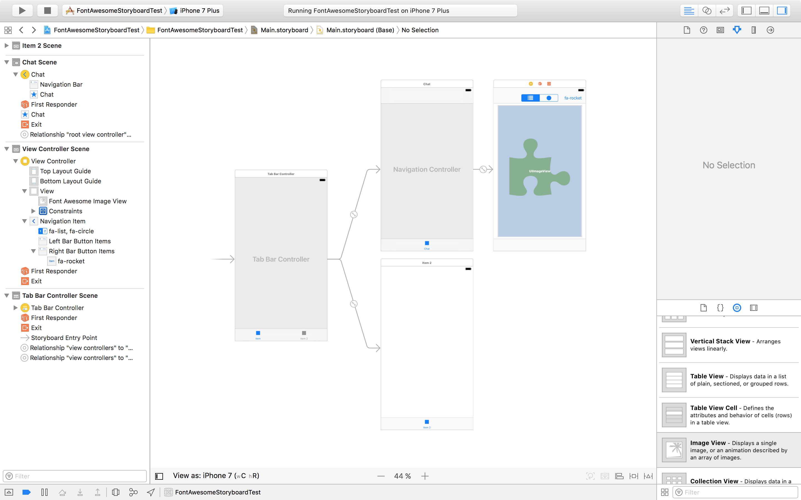

| 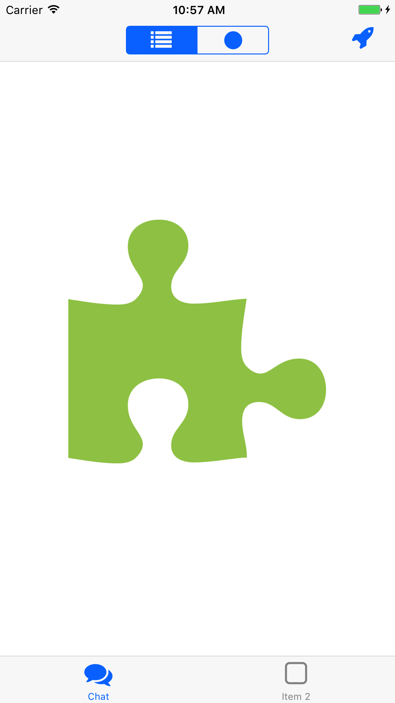 | 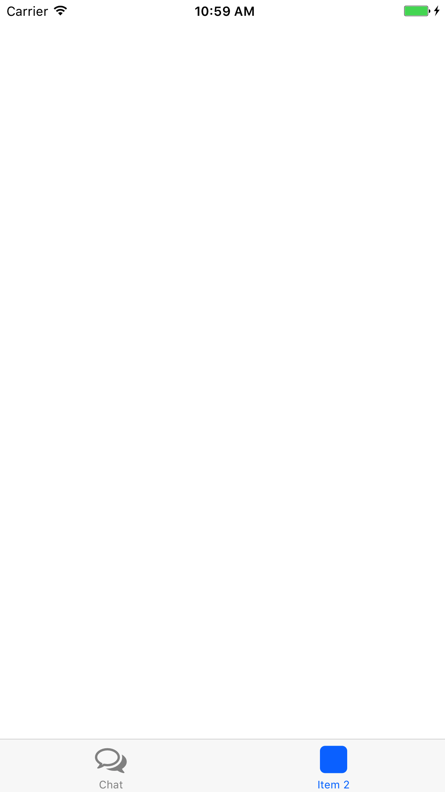 |
|:---:|:---:|
| First tab selected | Second tab selected |

### Text based controls

When using text based controls (FontAwesomeSegmentedControl and FontAwesomeBarButtonItem) you can set a property called `isFontAwesomeCSSCode`. This property indicates whether the text is raw entered as a FontAwesome Icon (you can paste icons as raw text) or a css code was used e.g. fa-squre.

### FontAwesomeImageView

| 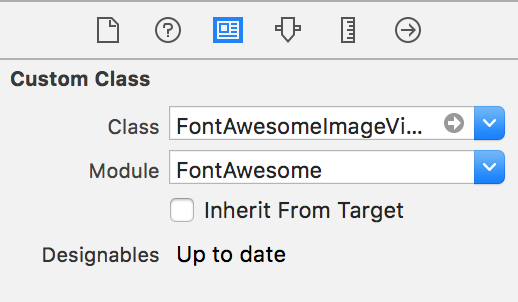 | 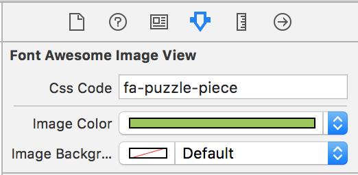 |
|:---:|:---:|
| Set class | Set attributes |

### FontAwesomeBarButtonItem

| 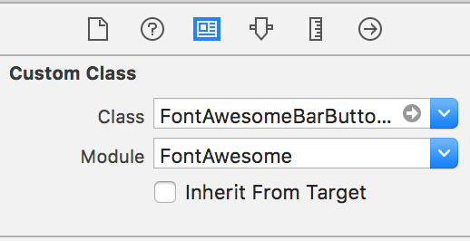 | 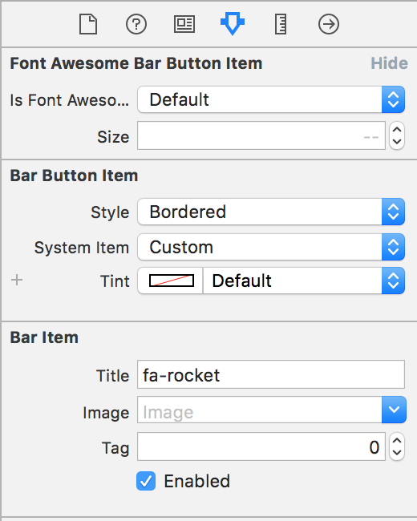 |
|:---:|:---:|
| Set class | Set attributes |

### FontAwesomeSegmentedControl

| 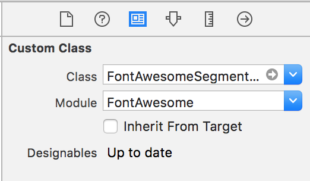 | 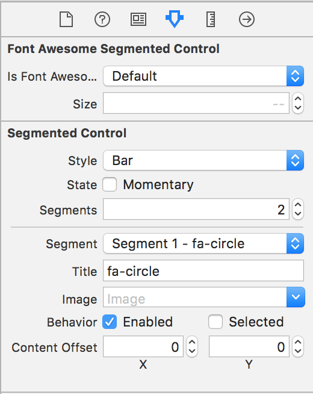 |
|:---:|:---:|
| Set class | Set attributes |

### FontAwesomeTabBarItem

| 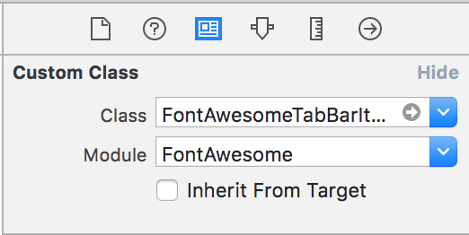 | 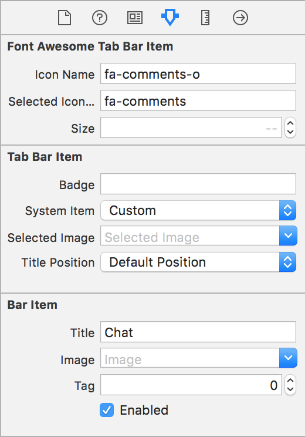 |
|:---:|:---:|
| Set class | Set attributes |

## Requirements

iOS 8 or later.

## License
- FontAwesome.otf file licensed under [SIL OFL 1.1](http://scripts.sil.org/OFL)
- FontAwesome.swift licensed under [MIT](http://thi.mit-license.org/)
