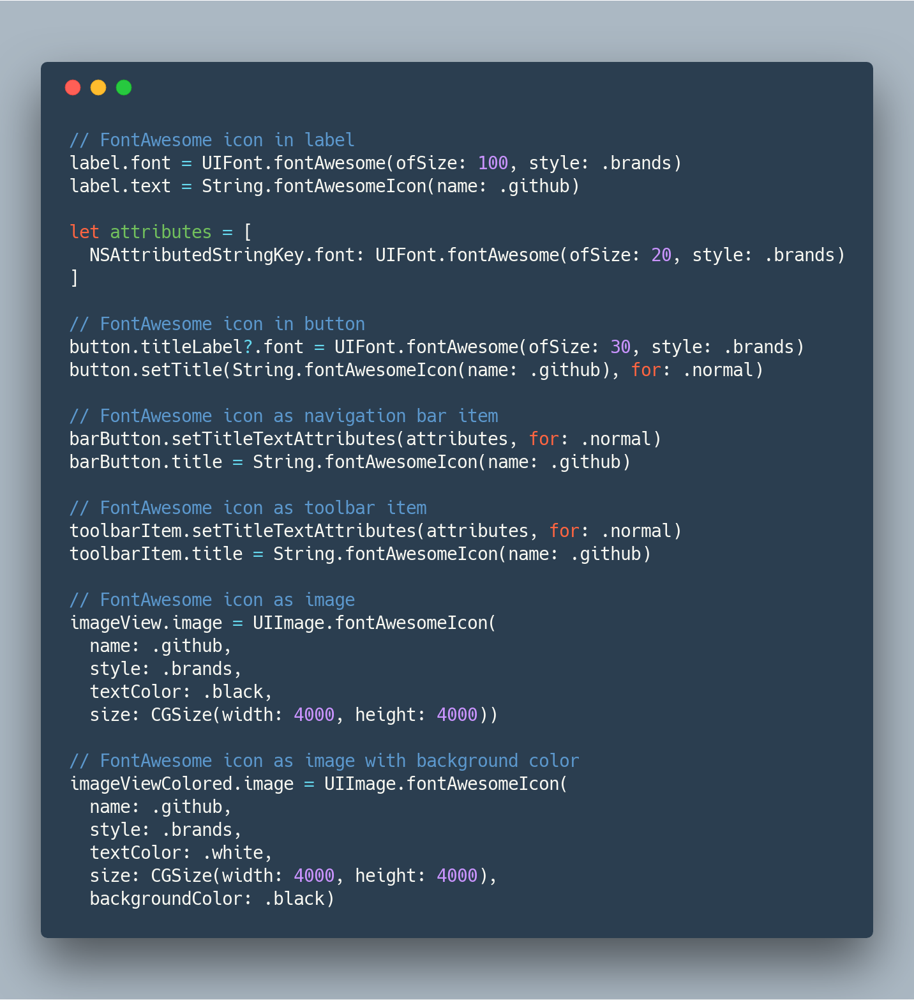

# FontAwesome.swift

[](https://travis-ci.org/thii/FontAwesome.swift)
[](https://img.shields.io/cocoapods/v/FontAwesome.swift.svg)
[](https://github.com/Carthage/Carthage)
[](http://cocoadocs.org/docsets/FontAwesome.swift)
[](https://raw.githubusercontent.com/thii/FontAwesome.swift/master/LICENSE)

Use Font Awesome in your Swift projects

To see the complete set of 3,652 icons in Font Awesome 5, please check the [FontAwesome.com](http://fontawesome.com/icons/) site.

## Examples


## Installation

### Carthage

To integrate FontAwesome into your Xcode project using Carthage, specify it in your `Cartfile`:

```ogdl
github "thii/FontAwesome.swift"
```

Then add `import FontAwesome` to the top of the files using FontAwesome.

### CocoaPods

To integrate FontAwesome into your Xcode project using CocoaPods, specify it in your `Podfile`:

```ruby
source 'https://github.com/CocoaPods/Specs.git'
platform :ios, '8.0'
use_frameworks!

pod 'FontAwesome.swift'
```

Then, run the following command:

```bash
$ pod install
```

And add `import FontAwesome_swift` to the top of the files using FontAwesome
(**Note**: There is an underscore).

### Manually
- Drag and drop all `.otf` and `.swift` files into your project

## Requirements

iOS 8 or later.

## Development
To update this project to include all the latest icons from the new verison of
Font Awesome (replace `x.y.z` with the new font version):

    bundle exec fastlane update_font version:x.y.z

To release a new version `x.y.z` (replace `x.y.z` with a real version number):

    bundle exec fastlane release version:x.y.z

Since it will automatically make a new commit to bump version and push to CocoaPods
trunk, make sure you have write access to this repo and be one of the podspec owners.
If you are a maintainer but don't have these privilege yet, please let me know.

## License
- All font files licensed under [SIL OFL 1.1](http://scripts.sil.org/OFL)
- FontAwesome.swift licensed under [MIT](http://thi.mit-license.org/)
